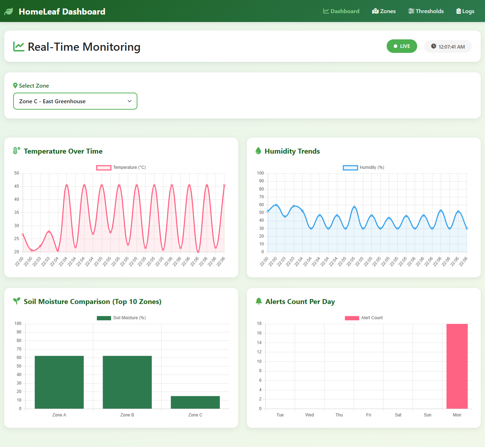
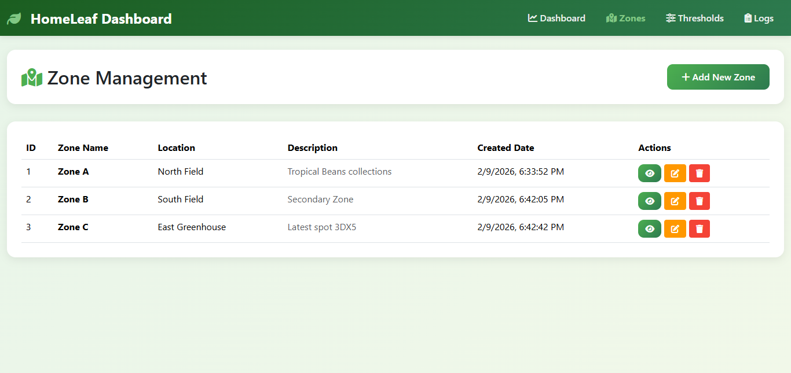
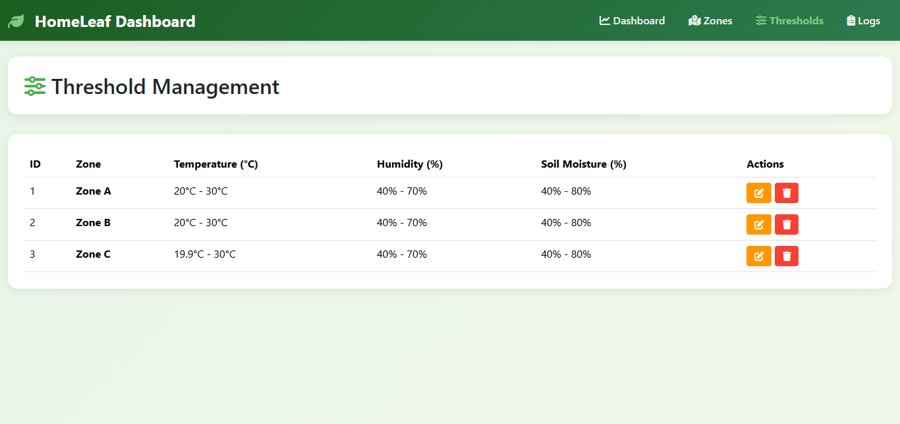
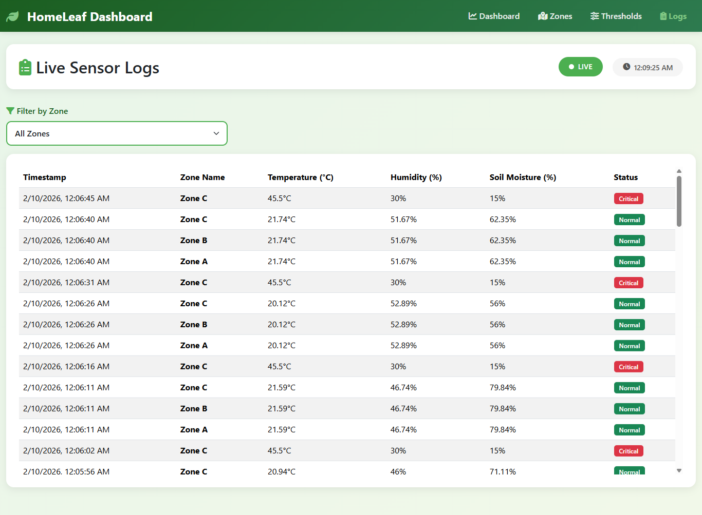
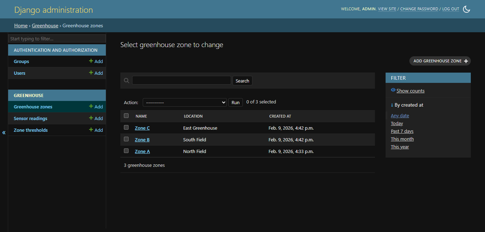
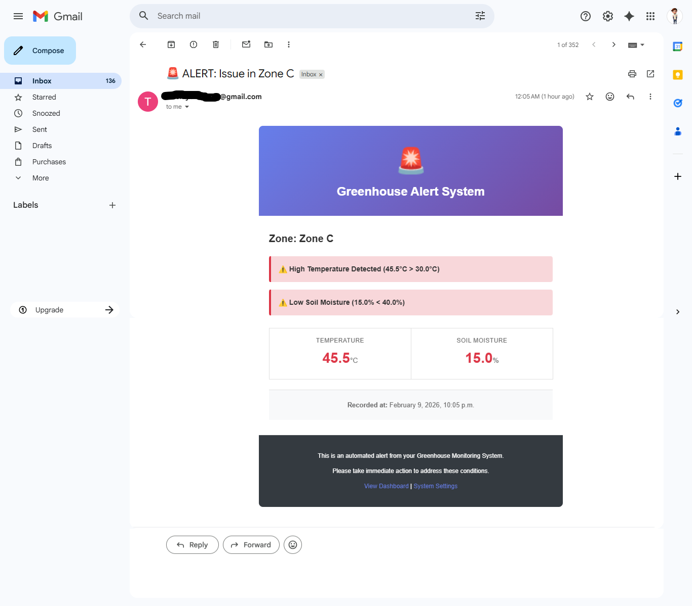

# Smart Greenhouse Monitoring System

   

## 📖 Project Overview

The **Smart Greenhouse Monitoring System** is a web-based IoT dashboard designed for the "Green House" use case. It allows users to remotely access in real time environmental conditions (Temperature, Humidity, Soil Moisture) across multiple greenhouse zones.

The system leverages **AWS RDS (MySQL)** for scalable storage, **Chart.js** for real-time visualization, and a **RESTful API** for sensor data simulation. It also features an automated email notification system for critical alerts.

## ✨ Key Features

* **Dynamic Dashboard**: Real-time visualization using Line and Bar charts.
* **Cloud Integration**: secure database connection to AWS RDS MySQL.
* **RESTful API**: Full CRUD capabilities for IoT sensor nodes and Postman simulation.
* **Automated Alerts**: Email notifications via Gmail SMTP when thresholds are breached.
* **Zone Management**: Add, edit, and delete greenhouse zones dynamically.

## 🛠️ Technology Stack

* **Backend**: Python 3.12, Django, Django REST Framework (DRF).
* **Database**: AWS RDS (MySQL) for production, SQLite for dev.
* **Frontend**: HTML5, Bootstrap 5, JavaScript (AJAX), Chart.js.
* **Tools**: Postman, Git/GitHub.

## 🚀 Installation & Setup

### Prerequisites

* Python 3.12+
* Git
* AWS RDS Endpoint (or local MySQL)
* Gmail App Password (for notifications).

### Step-by-Step Guide

1. **Clone the Repository**

    ```bash
    git clone https://github.com/Elthiero/greenhouse-monitoring.git
    cd greenhouse-monitoring
    ```

2. **Create Virtual Environment**

    ```bash
    python -m venv venv
    # Windows
    venv\Scripts\activate
    # Mac/Linux
    source venv/bin/activate
    ```

3. **Install Dependencies**

    ```bash
    pip install -r requirements.txt
    ```

4. **Environment Configuration**

    Create a `.env` file in the root directory and add the following:

    ```ini
    # AWS RDS Config
    # to connect mysql -h endpoint -P port -u username -p password
    DATABASE_ENGINE = django.db.backends.mysql
    DATABASE_NAME = greenhousedb
    DATABASE_USER= admin
    DATABASE_PASSWORD = your_db_passord
    DATABASE_HOST = aws_db_instance_endpoint
    DATABASE_PORT = 3306

    # Email configuration (GMAIL)
    EMAIL_BACKEND = django.core.mail.backends.smtp.EmailBackend
    EMAIL_HOST = smtp.gmail.com
    EMAIL_PORT = 587
    EMAIL_USE_TLS = True
    EMAIL_HOST_USER = your_email@gmail.com
    EMAIL_HOST_PASSWORD = your_google_app_code
    DEFAULT_FROM_EMAIL = GreenHouse <your_email@gmail.com>
    ADMIN_EMAIL = email_to_send_the_alert@gmail.com
    ```

5. **Run Migrations & Start Server**

    ```bash
    python manage.py makemigrations
    python manage.py migrate
    python manage.py createsuperuser
    python manage.py runserver
    ```

    Access the app at: `http://127.0.0.1:8000`.

## 🔌 API Endpoints

Test these endpoints using Postman.

| Method | Endpoint | Description | Action |
| :--- | :--- | :--- | :--- |
| `GET` | `/api/zones/` | List all greenhouse zones | Full CRUD |
| `POST` | `/api/readings/` | Push new sensor data (Triggers Alerts) | Get and Post |
| `GET` | `/api/thresholds/` | View current safety limits | Get and Put/Patch only |

**Sample JSON Payload for `/api/readings/`**:

Add Content-type: Application/json inside the header

```json
{
    "zone": 1,
    "temperature": 28.5,
    "humidity": 60,
    "soil_moisture": 45
}
```

## 📸 Project Screenshots








